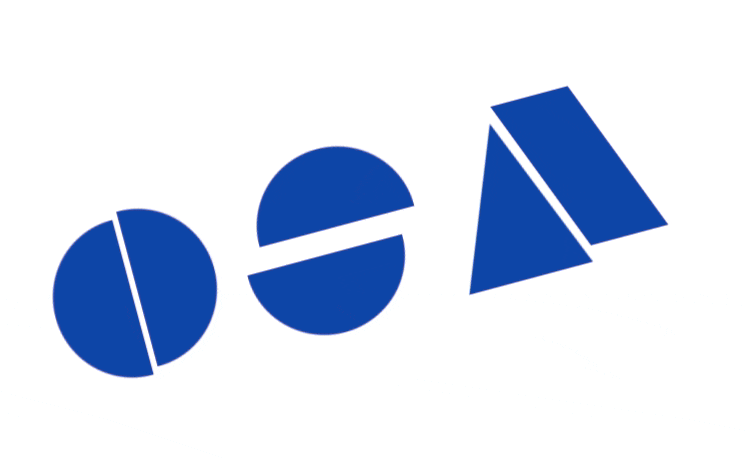

<h1 align="center">Hi , I'm Omar Sherif Ali</h1>

<table align="left" border="0.1" bgcolor="#ffffff">
  
 <tr border="0" bgcolor="#ffffff">
    <td border="0" bgcolor="#ffffff">
    
    </td>
 </tr>

 <tr border="0" bgcolor="#ffffff">
    <td border="0" bgcolor="#ffffff">

      </td></tr>  
   <tr>
    <td>
      </td></tr>    

   <tr>
    <td>
    </td></tr>    

  <tr>
    <td>
     
   </td>
</tr>    
  
  <tr>
    <td >
    
   </td>
</tr>    

</table>

  
  

    
    
<a href="https://osa-portfolio.vercel.app/" ><strong>My Portfolio ! </strong></a>
                                                                  
 
📄<a href="https://drive.google.com/file/d/1QyBWTurZ4MFq8ePxewEVQZ9kzTwtj1PI/view?usp=sharing" download target="_blank">CV</a>    ·
  :telephone_receiver: <a href="tel:+201008757772" >Call Me +201008757772</a>
    ·
    :mailbox: <a href="mailto:omar.sherif9992@gmail.com?cc=&subject=Omar's%20Github&body=Dear%20Omar%20Sherif%20Ali%2C%0D%0A%0D%0A%0D%0A%0D%0A%0D%0A%0D%0ARegards%2C%0D%0A%5BYour%20Name%5D%0D%0A%5BYour%20Phone%20Number%5D%0D%0A%5BLinkedin%20to%20connect%5D%0D%0A%5BCompany%20name%5D%0D%0A%0D%0A" target="_blank">
                                                                 Mail Me </a>
   	      ·
    :muscle: <a href="mailto:osa.helpme@gmail.com?subject=I%20want%20to%20be%20a%20Contributor&body=Dear%20Omar%20Sherif%20Ali%2C%0D%0A%0D%0A%0D%0A%0D%0A%0D%0A%0D%0ARegards%2C%0D%0A%5BYour%20Name%5D%0D%0A%5BYour%20Phone%20Number%5D%0D%0A%5BLinkedin%20to%20connect%5D%0D%0A%5BCompany%20name%5D%0D%0A%0D%0A" target="_blank">Be a Contributer</a>
  

  

  

 Currently I'm pursuing 📜 a Bachelor's degree in Computer Science and Engineering ~<a href=""><strong>The German University in Cairo </strong></a>:school:

  
I :heart: being creative 💡 and building :running: Useful Software and Hardware Applications that may serve the Community :pray: one day

  
I'm looking to work on real big Projects 👩‍💻 and seeking an internship

  
Come on :speech_balloon: me !

  

  
<table>
  <tr>
    <td>
      <h3 align="center">Front End</h3>
       
    </td>
    
    
  <td>  
          <h3 align="center">Back End</h3>

       <              

    </td>
    <td>
      <h3 align="center">Tools</h3>
  

        
  

    </td>
  </tr>
  
  </table>

<!-- 
   -->
<!--  -->
  

Made with ❤️ by Omar Sherif Ali - OSA.

© OSA - 2022

